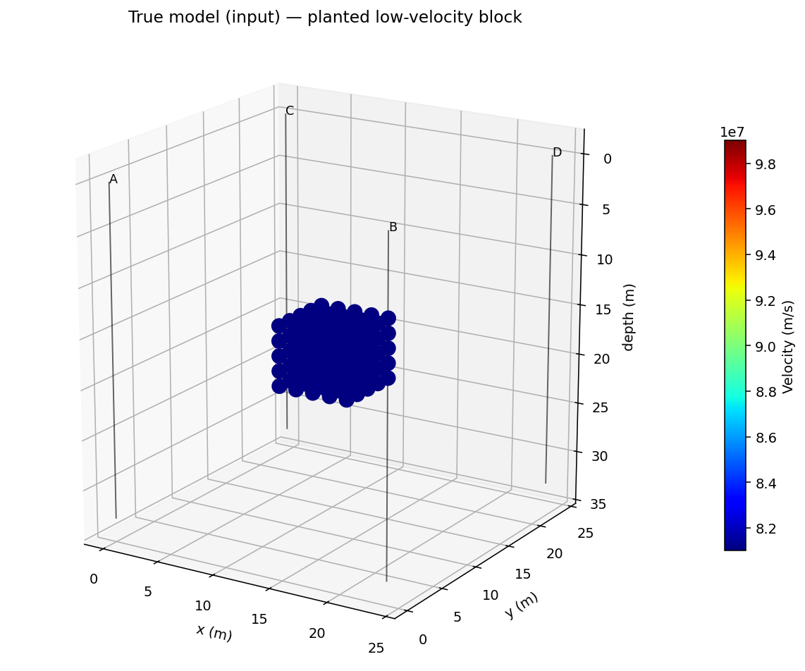
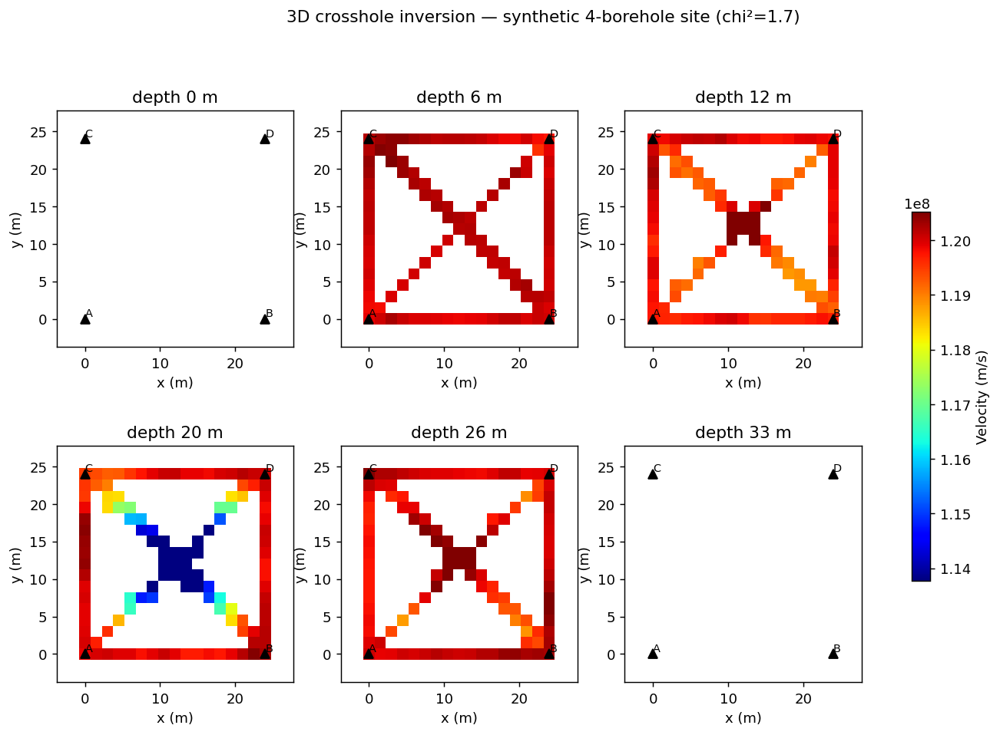
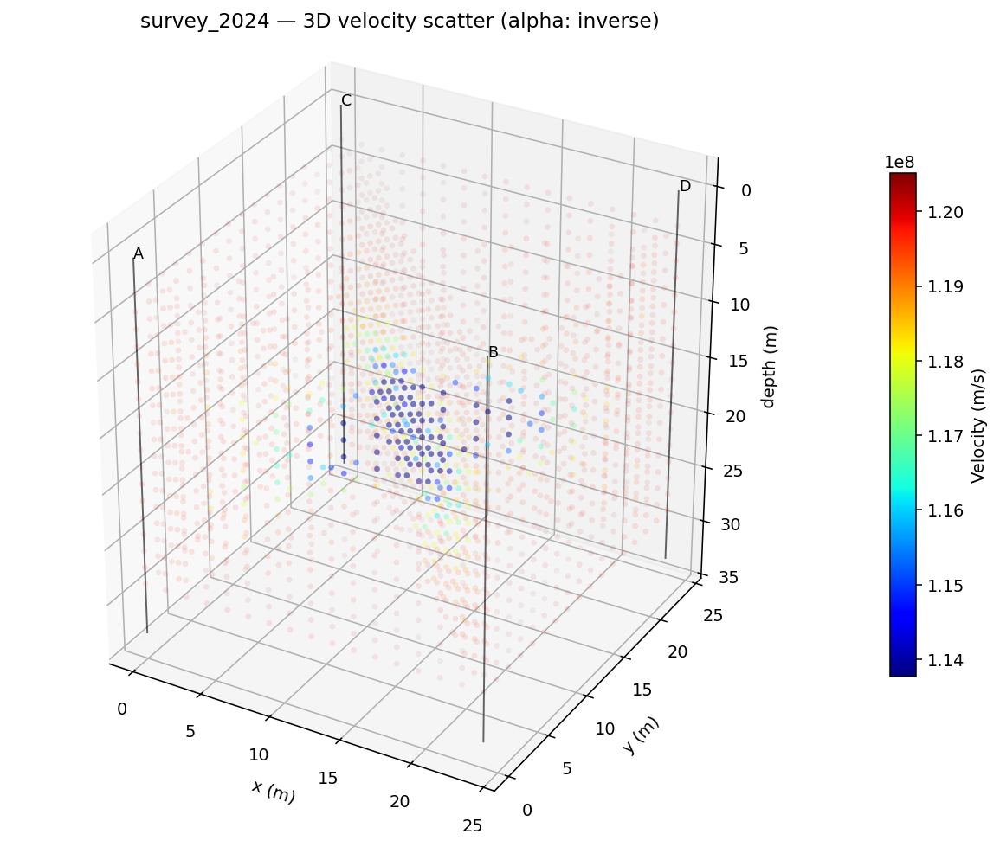
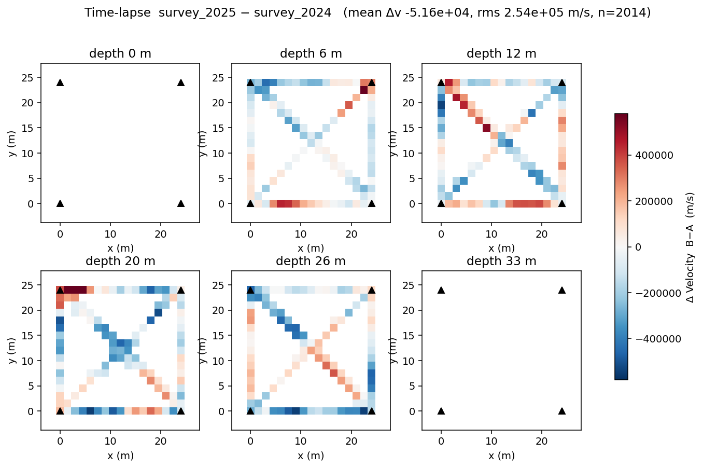
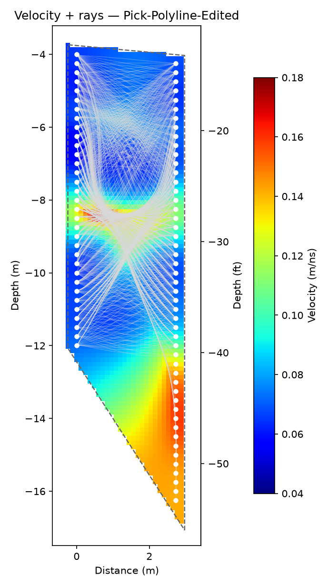
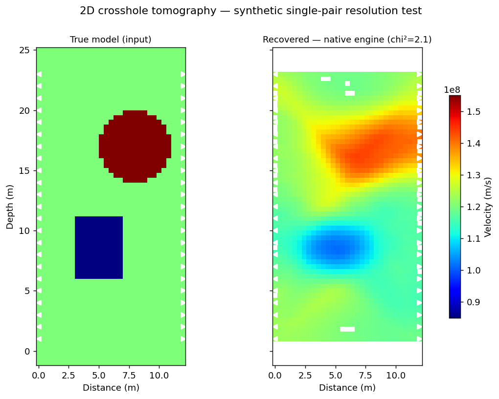

  

# Bifrost — Borehole GPR Tomography

**Bifrost turns crosshole GPR traveltimes into velocity images of the ground
between boreholes — in 2D panels or full 3D volumes, for any acquisition
geometry.**

> Named for **Bifrost**, the rainbow bridge between worlds in Norse
> mythology. Every ray in a crosshole inversion is a bridge between one
> borehole and another; the recovered velocity field is the rainbow left
> behind by thousands of such crossings.

| Synthetic model (input) | 3D inversion (recovered) | 3D velocity scatter | Time-lapse Δvelocity |
|---|---|---|---|
|  |  |  |  |

*A synthetic 4-borehole site: the planted low-velocity block (first), the
volume the inversion recovers from that geometry (second), the same volume as
a 3D scatter with velocity-scaled opacity (third), and the per-cell velocity
change between two surveys (fourth).*

## What it does for you

- **2D crosshole tomography** — a single borehole pair inverted to a
  velocity panel.
- **3D multi-borehole site inversion** — combine many borehole pairs into
  one velocity volume; choose which holes to include per run.
- **First-break picking** — automatic picking plus an interactive editor.
- **ZOP analysis** — zero-offset-profile velocity and porosity vs depth.
- **Synthetic resolution testing** — forward-model a known target on your
  real acquisition geometry, invert it, and see what that geometry can and
  cannot resolve — before you drill or trust an anomaly. A model painter
  lets you draw the test model by hand.
- **Time-lapse comparison** — quantitative velocity change between two
  surveys, even when the acquisitions don't share an exact grid.
- **Interactive 3D viewing** — spin the recovered volume; make slow
  anomalies pop with inverse-velocity opacity.

## Workflow

Two obvious starting points, one **Invert** button:

- **Open GPR data** — load raw crosshole records, auto-pick first breaks,
  review and edit the picks, then invert.
- **Open picks** — already have first-arrival picks from other software?
  Load the CSV directly and invert — no raw data, no re-picking. Common
  column layouts (including Sensors & Software exports) load as-is, and the
  traveltime unit is detected automatically.

Either path lands you at the same short screen: a data summary and geometry
preview, a compact settings panel (cell size, velocity bounds, domain), and
**Invert**. Resolution testing, 3D site inversion, ZOP profiling, and the
model painter live one level down in a Tools menu for when you need them.

**Editing picks:** picks are shown directly on the gathers — click a trace to
set or adjust its pick, undo/redo across the whole session, step through
gathers, and re-run auto-picking any time for a fresh start. Edited picks
feed straight into the inversion.

**QC on import:** every pick is checked against a hard physical limit on the
way in; impossible rows (a typo'd coordinate, a corrupted line, a
non-positive traveltime) are dropped automatically with a clear report of
what was rejected and why. You can also crop line ends or exclude individual
bad receiver depths.

## Supported data

- **Sensors & Software** and **MALA / RAMAC** borehole GPR files, read
  natively. Per-trace antenna depths are taken from the recorded headers
  where the format provides them, and can be overridden where it doesn't.
- **Pre-picked traveltime CSVs** from any picking software.

## Any geometry, not just boreholes

- **Crosshole** — the classic two-borehole panel.
- **Ring** — transducers on a circle around a cylinder cross-section: a tree
  trunk, a concrete column, a mine pillar.
- **Arbitrary** — fully free-form source and receiver positions, one
  measurement per row.

A domain mask (disk, rectangle, polygon, or the outline of the transducers)
keeps the physics honest: rays cannot shortcut outside the medium — for
example through the air around a cylinder — and the region outside the
boundary is excluded from the result.

## The inversion

The forward physics is a full eikonal traveltime solver — real refraction and
curved rays, not a straight-ray approximation — paired with a regularized
least-squares inversion that scales to hundreds of sensors per hole.
Iteration stops when the picks are fit to within their stated uncertainty;
fitting further would be fitting noise. The engine is validated against an
independent open-source reference implementation, agreeing to ~96–98% on
synthetic benchmarks. Windows and Linux.

## Outputs & figures

Every inversion produces three publication-ready figures automatically:

1. **Velocity + rays** — the velocity tomogram with the final bent raypaths
   overlaid.
2. **Velocity + confidence** — the same field with poorly-resolved cells
   faded toward neutral, so the figure never implies confidence the data
   doesn't support.
3. **Raypaths** — the ray-coverage map on its own.

Sections render shallow-at-top regardless of the site's elevation
convention, cropped to fill the figure, with a secondary depth axis in feet
alongside the metric one.

Every figure is live in the viewer — adjust the color scale, colormap, and
aspect ratio before exporting — and a Bifrost tomogram can be combined with
results from other realms into one multi-panel report figure.

*Crosshole GPR velocity tomogram with raypaths (field data) — one of the
three figures generated automatically on every run.*

*A single borehole pair in 2D: a known model (left — a slow box and a fast
disc) forward-modelled through the pair geometry and inverted (right). The
box and disc come back in the right place; the vertical smearing is the
two-hole geometry's resolution limit, not the software.*

## Part of the Yggdrasil platform

Bifrost runs standalone or as a panel inside the [Yggdrasil
application](https://yetiskier.github.io/yggdrasil-docs/yggdrasil.html), with bundled example datasets, a live log, a
figure browser, and the embedded 3D volume and time-lapse viewer. Its
velocity models can directly drive [Midgard](https://yetiskier.github.io/yggdrasil-docs/midgard.html)'s depth
conversion in the same project.

## Availability

Bifrost is commercially licensed as part of the Yggdrasil suite (Windows and
Linux). Contact **[joel@aesirmt.com](mailto:joel@aesirmt.com)** for
licensing and installers.

[← Back to the suite overview](https://yetiskier.github.io/yggdrasil-docs/yggdrasil.html)
