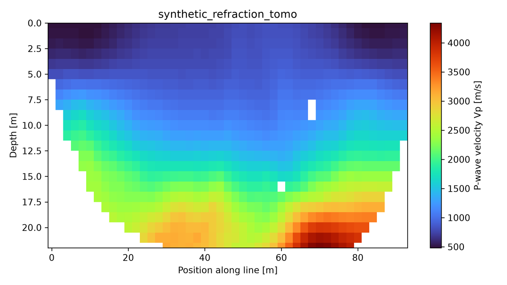

  

# Heimdall — Seismic Refraction

**Heimdall turns picked first arrivals into a P-wave velocity (Vp) model of
the near surface — crisp layer models, smooth tomograms, or both from the
same picks.**

> Named for **Heimdall**, watchman of the gods and keenest of hearing — he
> catches the first faint sound. Refraction interpretation lives or dies on
> the first break.

## What it does for you

Fire an impulsive source (a sledgehammer on a plate, a weight drop) into the
ground and record the arrivals on a line of geophones. Beyond a crossover
distance, the first arrival at each geophone is a head wave critically
refracted along a deeper, faster layer, and its move-out encodes the Vp
structure and the depth to each refractor. Refraction Vp is the go-to method
for:

- **Depth to bedrock** — the classic refraction target, from the
  soil-to-rock velocity contrast.
- **Water table** — the sharp Vp jump into saturated ground.
- **Rippability** — bedrock velocity keys directly into excavation-effort
  charts.
- **Void, fault, and weathered-layer mapping** — lateral velocity anomalies
  and offsets in the refractor.

## Workflow

1. **Open your records** — SEG-2, SEG-Y, or SU shot gathers; receiver and
   source geometry are read from the files.
2. **Pick first breaks** — automatic picking per gather or across the whole
   line, then click on the gather to refine any pick.
3. **Assemble traveltimes** — forward and reverse traveltime–offset curves
   built from the picks.
4. **Interpret** — layer methods, tomography, or both.
5. **Export** — the Vp section with its traveltime misfit reported, as a
   publication-quality figure.

## Two interpretation methods

- **Classic layer methods** — intercept-time and the **Generalized
  Reciprocal Method (GRM)** fit the direct and head-wave branches of a
  reversed spread for true layer velocities and dipping or undulating
  interface depths.
- **Refraction tomography** — a regularized inversion on a velocity grid
  gives a smooth Vp section that captures gradual velocity change and
  lateral variation the layer models cannot.

Use them together: the layer model gives crisp interface depths, and the
tomogram shows the gradients and lateral structure between them.

*Refraction tomography Vp section. Synthetic illustration.*

## Supported data

The standard engineering-seismograph formats, read directly:

| Format | Notes |
|---|---|
| **SEG-2** | The engineering-seismograph format (Geometrics, Seistronix); receiver/source locations and sample interval read from the file. |
| **SEG-Y** | Including both common floating-point and integer sample encodings. |
| **SU** | Seismic Unix records. |

## Outputs & figures

- Picked gathers and forward/reverse traveltime curves.
- Layered refraction models with interface depths.
- Gridded Vp tomograms with reported misfit, exported as
  publication-quality figures.

## One spread, two methods

Seismic refraction (Heimdall) and MASW ([Mjölnir](mjolnir.html)) run on the
**same field records**. Acquire one seismic spread and get both refraction
P-wave velocity (Vp, Heimdall) and surface-wave shear velocity (Vs,
Mjölnir) — and together Vp/Vs and Poisson's ratio, a powerful joint
constraint on saturation and material properties. The two realms group under
a **Seismic** category in the Yggdrasil application and share the imported
records.

## Part of the Yggdrasil platform

Heimdall runs standalone or inside the [Yggdrasil
application](yggdrasil.html). Vp sections publish into the project's shared
3D scene, draped against the site terrain alongside the site's other
geophysics, and every processing setting is a labelled control in the GUI.

## Availability

Heimdall is commercially licensed as part of the Yggdrasil suite (Windows and
Linux). Contact **[joel@aesirmt.com](mailto:joel@aesirmt.com)** for licensing
and installers.

[← Back to the suite overview](yggdrasil.html)
