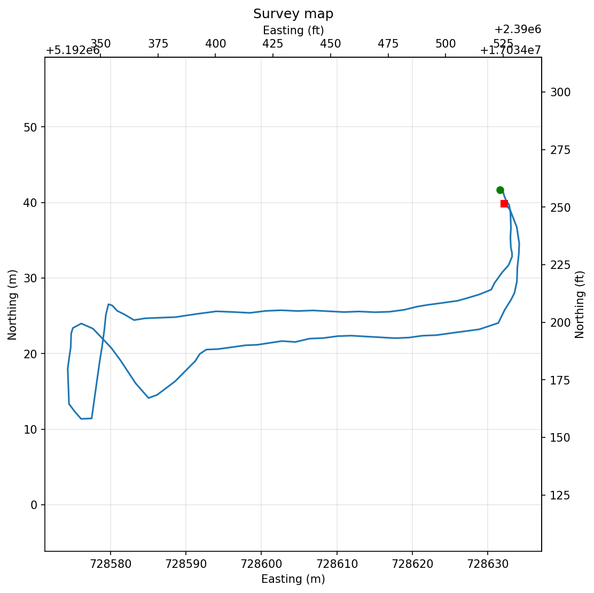
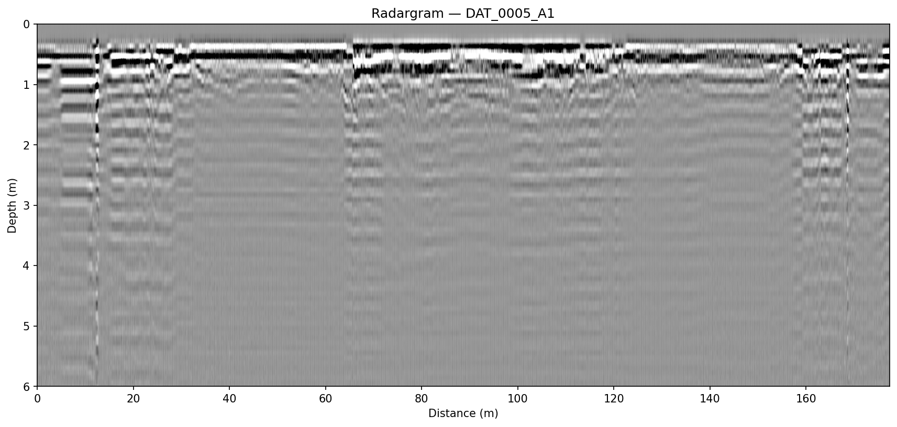
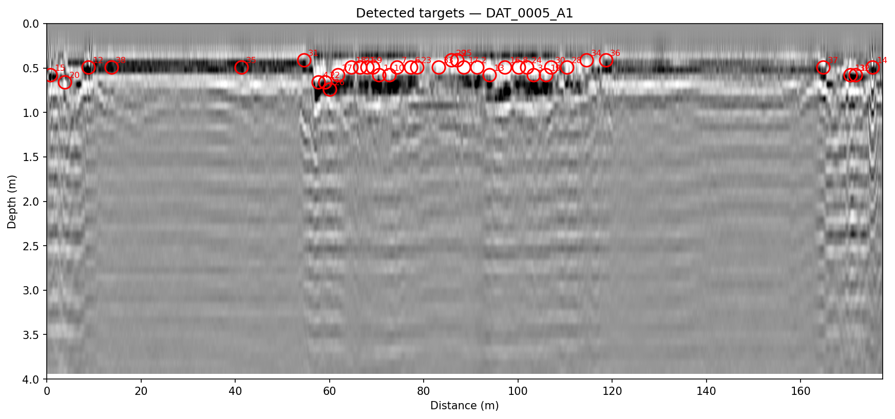
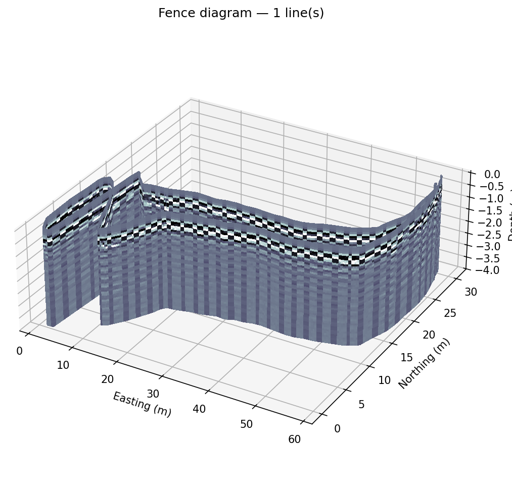

  

# Midgard — Surface GPR

**Common-offset ground-penetrating-radar processing** — read MALA,
Sensors & Software, or GSSI lines, geolocate every trace from the GPS track,
run a configurable processing pipeline, and visualise in 2D (radargrams,
survey maps) and 3D (fence diagrams, depth-slice C-scans) — from a CLI or a
desktop GUI, standalone or embedded in the Yggdrasil shell.

> Named for **Midgard**, the Norse middle realm of humankind — the shallow,
> lived-in ground where near-surface GPR looks for anthropogenic features:
> utilities, graves, foundations, voids, UXO.

## Instrument and format support

- **MALA / RAMAC** `.rd3`/`.rd7` (+ `.rad`), with `.cor` GPS tracks
- **Sensors & Software** `.dt1`/`.hd`
- **GSSI** `.dzt`

Formats are auto-detected from the file extension via a pluggable reader
registry, and every downstream step is format-agnostic.

## Geolocation

GPS fixes are interpolated to every trace and projected to UTM
(millimetre-accurate built-in transform; other CRSs supported). Because
time-triggered acquisition bunches traces at turns and stops, each line is
resampled to even along-line spacing so the displayed radargram is
true-to-distance — essential for hyperbolas to plot and fit correctly.
Lines without GPS fall back to even/odometer spacing or a configured
anchor.

## Processing

A **reorderable** filter pipeline: time-zero correction (five methods,
including per-trace first-break alignment), dead-trace removal, spreading-loss
gain, dewow, mean-trace removal, bandpass (auto-tuned from the antenna
frequency) or Ormsby, eigenimage filtering, and clipping. In the GUI the
pipeline is a drag-to-reorder list; every parameter is a labelled widget.

Radargrams support time or depth axes in metres, feet, and nanoseconds (any
combination, on one figure), smoothing, true-scale aspect, and topographic
correction — traces hung from their per-trace GPS elevation.

## Velocity, migration, and target detection

- **Hyperbola velocity analysis** — click an apex and drag the limbs to fit;
  a semblance scan provides the initial guess. Each pick carries a depth and
  map coordinates, overlays on the radargram, drops into the 3D fence view,
  and exports to CSV.
- **Migration** — Kirchhoff diffraction-stack (time-domain) or Stolt f-k
  (frequency-wavenumber), collapsing point-target hyperbolas to their apex.
- **Automatic target detection** — on a migrated section, laterally
  continuous geology is suppressed so compact anomalies pop; detected
  targets are reported with along-line position, depth, strength, and map
  coordinates, as a labelled overlay and a CSV.

## 2D and 3D visualisation

- **Depth slices (C-scans)** — every trace plotted at its true map position,
  coloured by amplitude at that depth, on a single global colour scale so
  slices at different depths stay comparable. A GUI slider sweeps depth live.
- **3D fence diagrams** — radargram curtains standing at their true GPS
  paths, with depth slices floated at their depths in the same scene, plus
  2D contact sheets and an orbiting-turntable export.
- **3D data cube** — many lines binned onto a regular grid for export and
  interop.

## In the Yggdrasil shell

Midgard publishes migrated lines, depth slices, and auto-detected targets
into a project's shared 3D scene. Once the project has a basemap DEM, radar
curtains drape from it automatically — far cleaner than raw GPS elevations.
A velocity volume produced by [Bifrost](bifrost.html) in the same project
can drive Midgard's depth conversion directly, and
[Niflheim](niflheim.html)'s conductivity grids render under the radar
curtains for joint interpretation.

## Availability

Midgard is commercially licensed as part of the Yggdrasil suite (Windows and
Linux). Contact **[joel@aesirmt.com](mailto:joel@aesirmt.com)** for
licensing and installers.

[← Back to the suite overview](index.html)
