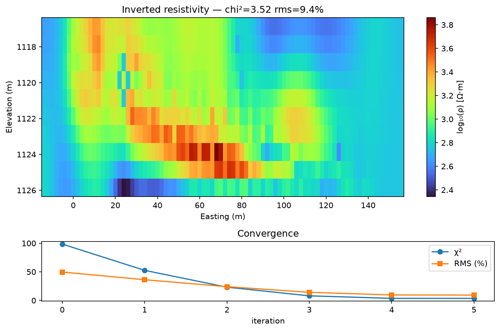
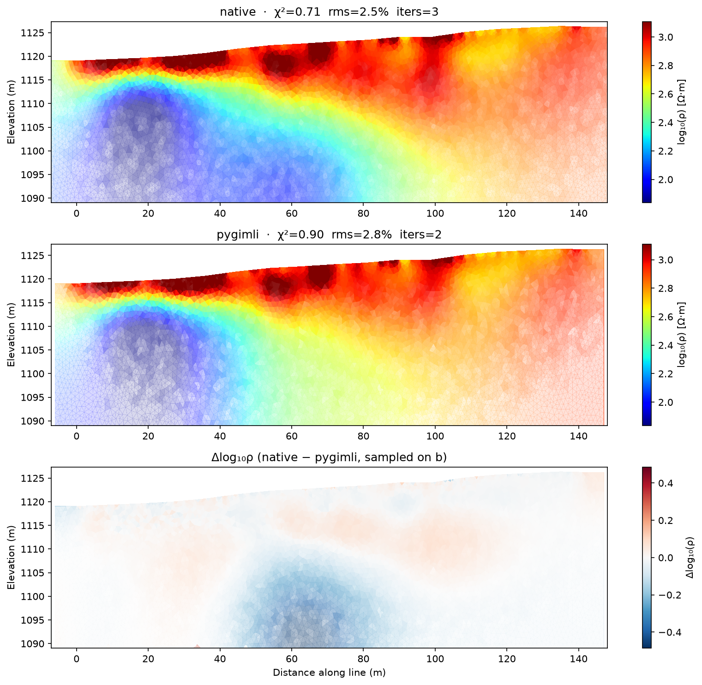
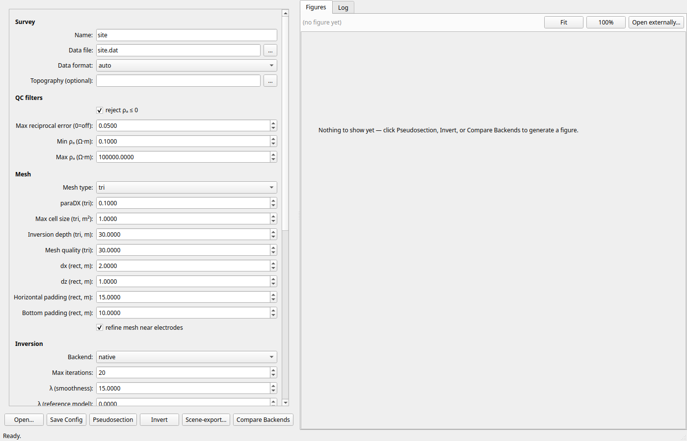

  

# Mimir — Electrical Resistivity Tomography

**Mimir takes an ERT survey from the instrument file to a georeferenced,
inverted resistivity section — with the QC and editing to trust it.**

> Named for **Mimir**, the well of wisdom at the root of Yggdrasil, whose
> waters the Æsir drink to see beneath the surface of things. ERT looks
> beneath the ground by the same principle — measuring how far a current
> soaks into the earth to reveal the water, salt, clay, and voids the
> surface hides.

## What it does for you

- Reads your raw resistivity-meter files directly — no export step through
  third-party software.
- Computes apparent resistivity for the standard arrays (Wenner,
  Schlumberger, dipole-dipole) and lets you inspect and clean the data
  before inversion.
- Inverts to a 2D section or 3D volume with honest uncertainty display:
  cells the data can't resolve fade out instead of being presented as fact.
- Georeferences the line from a handful of GPS fixes and real terrain
  elevations, so the section lands correctly on the site map.
- Handles induced polarization (IP) alongside resistivity.

*Inverted section with confidence shading — cells the data can't resolve
fade out.*

## Workflow

1. **Open your survey** — load the raw instrument file; electrode geometry
   and measurements are read automatically.
2. **QC and edit** — run the automatic filters (spike, range, reciprocal
   error, misfit trim), then review interactively: per-level profile and
   pseudosection views, click a point to toggle it, rubber-band bulk select,
   full undo/redo. Every removal is documented and reversible.
3. **Georeference** — tag as few as two electrodes with GPS coordinates
   (more for bent lines); the rest interpolate along the tape. Electrode
   elevations can come straight from the site terrain model, and mismatch
   warnings flag layout errors early.
4. **Invert** — choose depth of investigation, smoothing, and error
   settings; the inversion runs until the data are fit to within their
   stated errors.
5. **View and export** — see the section in the shared 3D scene, draped on
   the site terrain, and export publication-quality figures.

## Supported data

- **IRIS Syscal Pro** and **ProsysII** binary files, read natively.
- **Unified resistivity `.dat` format** — 2D or 3D electrode layouts with
  apparent-resistivity and per-measurement error columns.
- Topography from a surveyed profile or sampled automatically from the
  project's terrain model.

## Inversion you can trust

The inversion follows the ground surface with a topography-conforming mesh
and uses a smoothness-constrained least-squares scheme with a
physically-motivated error model and an adjustable vertical/horizontal
smoothing ratio. It stops when the data are fit to within their stated
errors — fitting further would be fitting noise.

*Results are cross-validated against an independent open-source reference
implementation on real field surveys — here a Wenner line, model correlation
0.958. The third panel fades where data coverage is low.*

## Outputs & figures

- Inverted 2D sections and 3D volumes with coverage-based confidence fade.
- Pseudosections, per-level QC profiles, and cleaned survey files.
- Publication-quality figure export throughout.

## Part of the Yggdrasil platform

Every setting is a labelled control grouped by tab (Survey / QC / Mesh /
Inversion / IP), with tooltips throughout, and runs execute in the background
so the interface never blocks. One click publishes the electrode layout,
pseudosection, and inverted section or volume into the [Yggdrasil
project](https://yetiskier.github.io/yggdrasil-docs/yggdrasil.html), where they render in the shared 3D scene alongside
GPR and EM results, draped on the site terrain.

## Availability

Mimir is commercially licensed as part of the Yggdrasil suite (Windows and
Linux). Contact **[joel@aesirmt.com](mailto:joel@aesirmt.com)** for
licensing and installers.

[← Back to the suite overview](https://yetiskier.github.io/yggdrasil-docs/yggdrasil.html)
