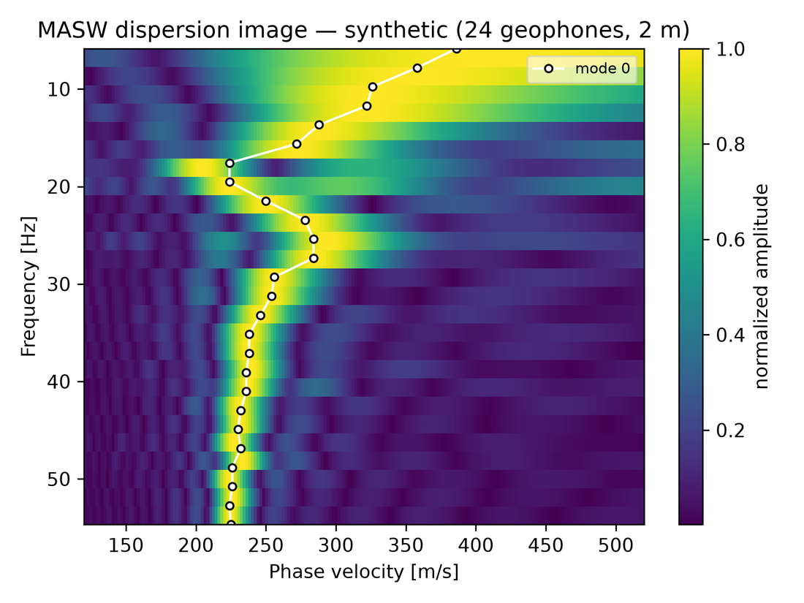

  

# Mjölnir — MASW / Surface Waves

**Mjölnir turns a multichannel seismic record into a shear-wave velocity
(Vs) model of the ground — the standard, non-invasive measure of soil
stiffness.**

> Named for **Mjölnir**, Thor's hammer — MASW is a hammer-source method. The
> strike is the seismic source, and the ground rings back in surface waves.

## What it does for you

A seismic record from an impulsive source (a sledgehammer on a plate) is
dominated by **Rayleigh surface waves**, which are dispersive: each frequency
travels at a phase velocity set by the shear-wave velocity of the ground down
to roughly half its wavelength. Mjölnir images that dispersion, lets you pick
the curve, and inverts it for a layered Vs profile. Vs is the standard
measure of near-surface stiffness, which makes MASW the method of choice
for:

- **Vs30 and seismic site classification** — the code-driven average shear
  velocity in the top 30 m for building-code site class and ground-motion
  work.
- **Geotechnical site characterization** — soil stiffness for foundation and
  settlement design.
- **Depth to bedrock and soft-zone detection** — mapping the stiffness
  contrast between soil and rock, and finding weak or loose zones.
- **Liquefaction screening** — low-Vs saturated soils flagged from the
  section.

## Workflow

1. **Open your records** — SEG-2, SEG-Y, or SU shot gathers; receiver and
   source geometry are read from the files.
2. **Image the dispersion** — transform each gather into a
   frequency–phase-velocity image (phase-shift and slant-stack methods).
3. **Pick the curve** — auto-pick the fundamental mode, then click on the
   image to refine; higher modes are supported for deeper resolution.
4. **Invert** — a layered Vs(depth) model from the picked curve, with the
   data misfit reported.
5. **Build the section** — roll the spread along the line and stitch the 1D
   profiles into a 2D Vs section.

*Dispersion image with a picked fundamental-mode curve. Synthetic
illustration.*

## Supported data

The standard engineering-seismograph formats, read directly:

| Format | Notes |
|---|---|
| **SEG-2** | The engineering-seismograph format (Geometrics, Seistronix); receiver/source locations and sample interval read from the file. |
| **SEG-Y** | Including both common floating-point and integer sample encodings. |
| **SU** | Seismic Unix records. |

## Outputs & figures

- Dispersion images with picked curves.
- Layered Vs(depth) profiles with reported misfit, and Vs30.
- Stitched 2D Vs sections, exported as publication-quality figures.

Every figure is live in the viewer — adjust the color scale, colormap, and
aspect ratio before exporting — and a Vs section can be combined with
results from other realms (including a Heimdall Vp section from the same
spread) into one multi-panel report figure.

## One spread, two methods

MASW (Mjölnir) and seismic refraction ([Heimdall](https://yetiskier.github.io/yggdrasil-docs/heimdall.html)) run on the
**same field records**. Acquire one seismic spread and get both surface-wave
shear velocity (Vs, Mjölnir) and refraction P-wave velocity (Vp, Heimdall) —
and together Vp/Vs and Poisson's ratio, a powerful joint constraint on
saturation and material properties. The two realms group under a **Seismic**
category in the Yggdrasil application and share the imported records.

## Part of the Yggdrasil platform

Mjölnir runs standalone or inside the [Yggdrasil
application](https://yetiskier.github.io/yggdrasil-docs/yggdrasil.html). Vs profiles and sections publish into the
project's shared 3D scene, draped against the site terrain alongside the
site's other geophysics, and every processing setting is a labelled control
in the GUI.

## Availability

Mjölnir is commercially licensed as part of the Yggdrasil suite (Windows and
Linux). Contact **[joel@aesirmt.com](mailto:joel@aesirmt.com)** for licensing
and installers.

[← Back to the suite overview](https://yetiskier.github.io/yggdrasil-docs/yggdrasil.html)
