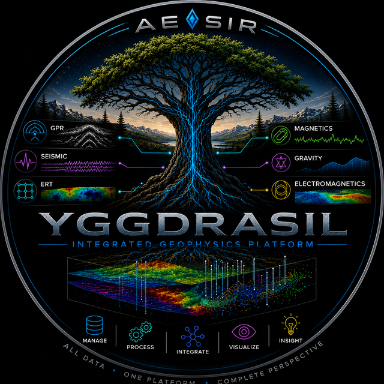
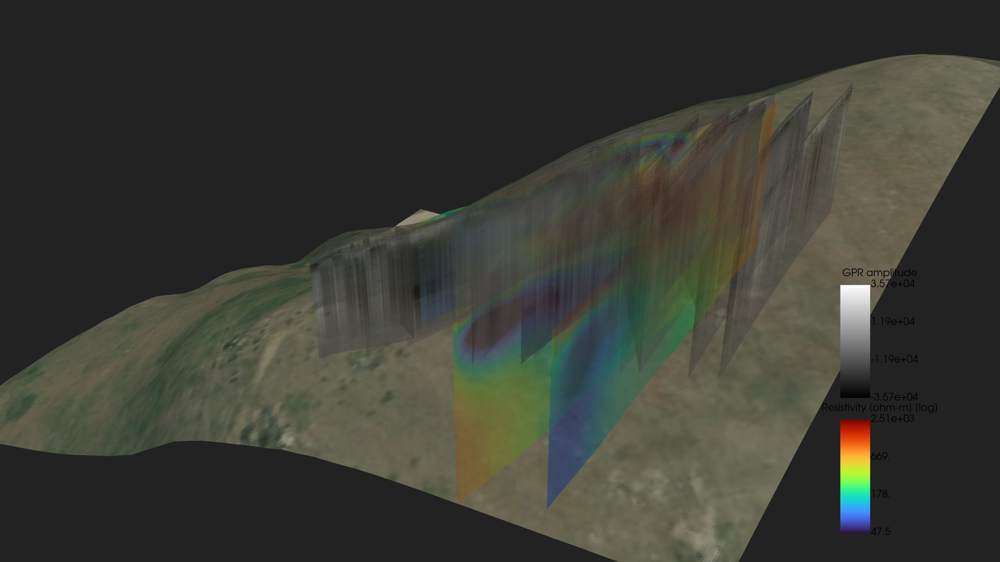
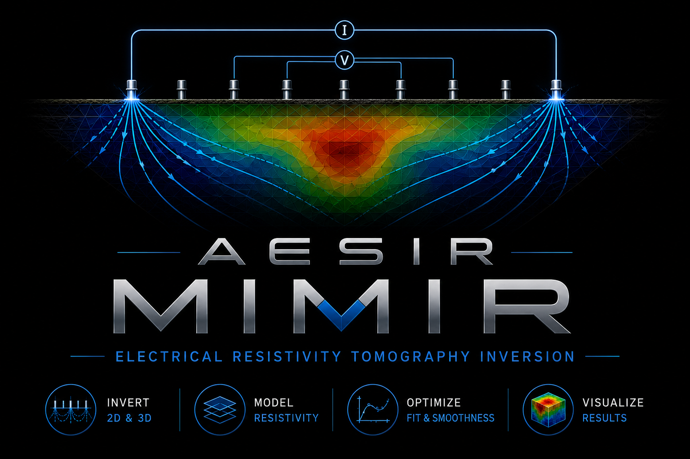
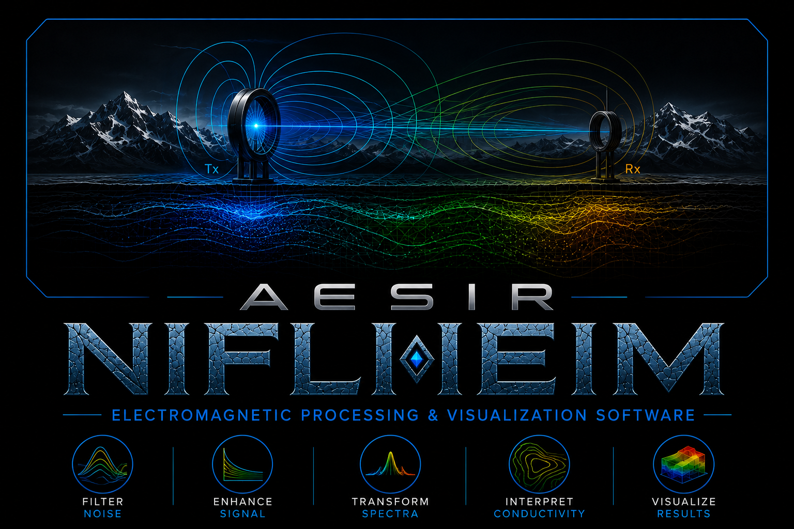
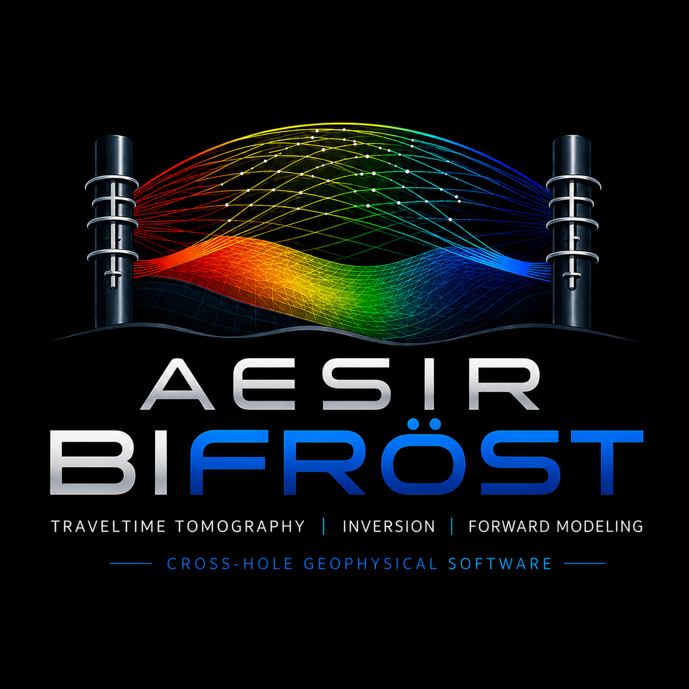
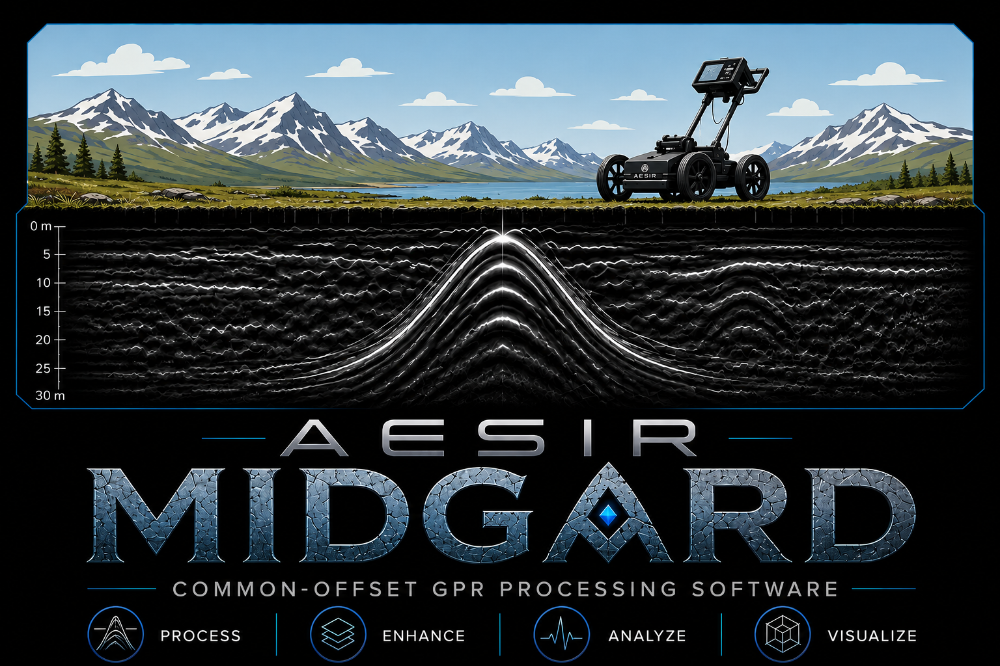
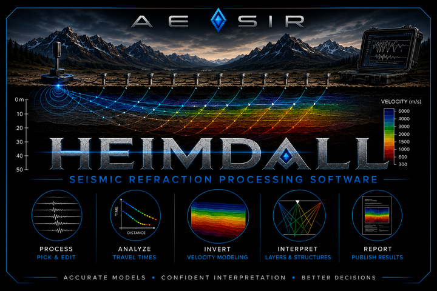
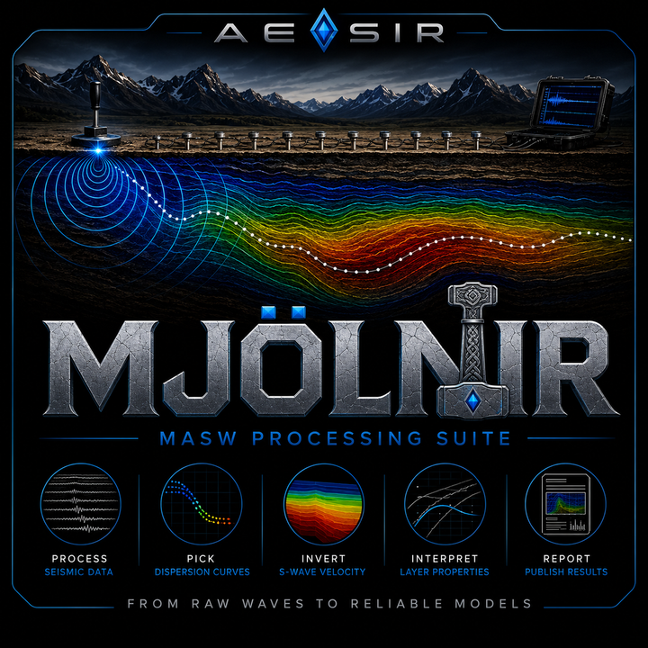

  

# The Yggdrasil suite

Yggdrasil is a commercial geophysical processing platform: one desktop
application, with independently licensed processing packages ("realms", each
named from Norse mythology) that share **one project and one 3D scene**. Buy
the method you need; the application is the same, and every data type you add
later lands in the same project and the same scene.

*One project, one scene: seven inverted resistivity sections and dozens of
migrated GPR radar profiles from the same site, rendered together beneath the
translucent terrain and aerial-photo basemap.*

## The platform

- **One project for the whole site.** All of a site's geophysics — every
  method, every survey, every result — lives in a single project you can
  archive, hand to a client, and reopen years later with nothing missing.
- **One 3D scene.** Every method renders into the same interactive 3D view —
  radar profiles, resistivity sections and volumes, EM conductivity maps,
  seismic velocity sections, boreholes, electrode layouts, detected targets —
  with a shared camera, consistent color scales per physical quantity, and
  adjustable vertical exaggeration. Saved views stay with the project.
- **Terrain and aerial imagery.** One click downloads an elevation model and
  aerial photo for the site and drapes them in the scene. Sections and radar
  profiles hang from the real terrain, and projects can be georeferenced from
  a local site grid, GPS fixes, or a standard map projection.
- **The tools follow your data.** The application shows the processing panels
  for the methods a project actually contains — a GPR-only project presents
  GPR tools; an EM-plus-resistivity project presents both. Every processing
  setting is a labelled control with a tooltip; nothing is hidden.
- **Methods that work together.** Results flow between realms through the
  project: a velocity model from Bifrost drives Midgard's depth conversion;
  Niflheim's conductivity maps drape beneath Midgard's radar profiles at the
  depth the instrument actually senses.
- **Publication-quality figures.** Every realm exports clean, consistently
  styled figures ready for a client report — sections, maps, tomograms, and
  3D scene views.
- **Windows and Linux.** The full suite runs on both platforms.

## The realms — organized by physics

The realms group by the type of data they process — **Electrical & EM**,
**GPR**, and **Seismic** — the same categories the application uses. Pick
the methods your practice needs.

### Electrical & EM

<table>
<tr>
<td width="110" align="center"></td>
<td><strong><a href="https://yetiskier.github.io/yggdrasil-docs/mimir.html">Mimir — Electrical Resistivity Tomography</a></strong> 
DC-resistivity and IP: Syscal Pro and standard-format data, interactive QC
and bad-point editing, GPS and terrain georeferencing, and 2D/3D resistivity
inversion.</td>
</tr>
<tr>
<td align="center"></td>
<td><strong><a href="https://yetiskier.github.io/yggdrasil-docs/niflheim.html">Niflheim — EM Ground Conductivity</a></strong> 
Frequency-domain EM (Geonics EM31-class instruments): GPS geolocation,
drift/despike/detrend processing, calibration control, map gridding, and
anomaly detection.</td>
</tr>
</table>

### GPR

<table>
<tr>
<td width="110" align="center"></td>
<td><strong><a href="https://yetiskier.github.io/yggdrasil-docs/bifrost.html">Bifrost — Borehole GPR Tomography</a></strong> 
Crosshole traveltime tomography in 2D and 3D — plus any acquisition geometry
(transducer rings, free-form layouts) — with first-break picking, ZOP
analysis, synthetic resolution testing, and time-lapse comparison.</td>
</tr>
<tr>
<td align="center"></td>
<td><strong><a href="https://yetiskier.github.io/yggdrasil-docs/midgard.html">Midgard — Surface GPR</a></strong> 
Near-surface common-offset GPR: MALA, Sensors &amp; Software, and GSSI data,
GPS geolocation, a reorderable processing pipeline, Kirchhoff and Stolt
migration, automatic target detection, and 3D fence diagrams.</td>
</tr>
</table>

### Seismic

<table>
<tr>
<td width="110" align="center"></td>
<td><strong><a href="https://yetiskier.github.io/yggdrasil-docs/heimdall.html">Heimdall — Seismic Refraction</a></strong> 
First-arrival refraction for P-wave velocity (Vp): first-break picking,
intercept-time / generalized reciprocal method layer models, and refraction
tomography — depth to bedrock, water table, and rippability.</td>
</tr>
<tr>
<td align="center"></td>
<td><strong><a href="https://yetiskier.github.io/yggdrasil-docs/mjolnir.html">Mjölnir — MASW / Surface Waves</a></strong> 
Multichannel analysis of surface waves for shear-wave velocity (Vs):
SEG-2/SEG-Y/SU records, dispersion imaging, curve picking, and layered Vs
inversion — Vs30 and geotechnical site characterization.</td>
</tr>
</table>

The two **Seismic** realms — Mjölnir (MASW) and Heimdall (refraction) — run on
the *same* seismic field records. Acquire one spread and recover both
surface-wave shear velocity (Vs) and refraction P-wave velocity (Vp), and with
them Vp/Vs and Poisson's ratio for joint interpretation.

## Licensing

Yggdrasil is commercially licensed, per method package. Licensing works
offline — no network connection required in the field — and each package is
independently sellable: a Mimir-only customer gets the full application with
Mimir active, and can unlock other realms later.

For licensing, pricing, and installers (Windows and Linux), contact
**[joel@aesirmt.com](mailto:joel@aesirmt.com)**.

---

*Yggdrasil is proprietary software by Aesir Consulting LLC.*

[← Back to the landing page](https://yetiskier.github.io/yggdrasil-docs/index.html)
